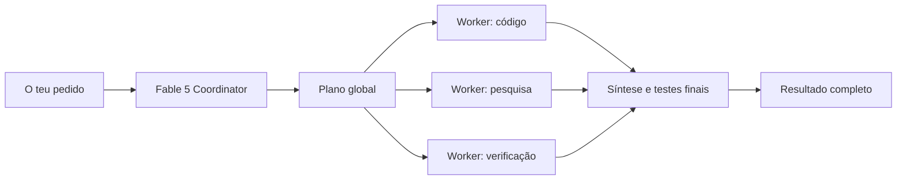

# Guia simples da ADE

## A ideia em uma frase

A ADE funciona como um router para agentes: liga as tuas subscrições, recebe um
objetivo e escolhe a melhor equipa para planear, executar e verificar o trabalho.

Não é uma cópia exata do OpenRouter. O OpenRouter encaminha chamadas de API entre
modelos; a ADE encaminha tarefas completas entre agentes, CLIs, skills, modelos e
fallbacks dentro da app Windows.



## Começar em dois minutos

1. Abre **Router > Start**.
2. Confirma que Claude e Codex aparecem como **Connected**.
3. Para Google, seleciona **Set up Gemini CLI** e termina o login oficial.
4. Cria ou abre uma tarefa na ADE.
5. Escolhe **Orchestrator** como agente.
6. Descreve o resultado pretendido e deixa a ADE escolher os especialistas.

## Um bom pedido

Usa esta estrutura:

```text
Objetivo: o resultado observável que quero.
Contexto: projeto, utilizadores e comportamento atual.
Limites: plataforma, ficheiros, custo, prazo ou coisas que não devem mudar.
Validação: testes, build e verificação visual esperados.
```

Exemplo:

```text
Implementa login com Google nesta app Windows. Mantém o design existente, não
exponhas tokens no renderer, testa sucesso e cancelamento, executa typecheck e
confirma visualmente o fluxo instalado.
```

## Como o Coordinator trabalha

O Coordinator segue o padrão **plan big, execute small**, adaptado do
[cookbook oficial da Anthropic](https://github.com/anthropics/claude-cookbooks/blob/main/managed_agents/CMA_plan_big_execute_small.ipynb):

1. Fable 5 entende o objetivo, inspeciona o necessário e cria o plano global.
2. O plano é dividido em briefs pequenos, independentes e verificáveis.
3. Workers especializados executam esses briefs, em paralelo quando possível.
4. Cada worker devolve apenas conclusões, evidências, alterações e validação.
5. O Coordinator espera pelos resultados, repete falhas temporárias, resolve
   conflitos e executa a verificação final.

Isto reduz contexto desperdiçado: páginas, logs e leituras grandes ficam no
worker que precisa deles, enquanto o modelo mais forte conserva o contexto para
decisões e síntese.

## Equipas automáticas

| Tipo de trabalho | Equipa preferida | Comportamento |
| --- | --- | --- |
| Projeto complexo | Fable orchestrated | Planeia, delega e julga |
| Funcionalidade | Premium coding | Implementação com fallback |
| Bug | Precision debug | Reprodução, causa raiz e regressão |
| Pesquisa | Deep research | Fontes, síntese e implementação |
| Interface | Frontend studio | Código, design e verificação visual |

## Quando abrir Advanced

Não precisas de **Advanced** para o uso normal. Abre-o apenas para:

- adicionar um provider ou endpoint personalizado;
- alterar aliases, fallback ou token saver;
- consultar modelos, pricing ou diagnósticos;
- integrar outra ferramenta com o gateway local compatível com OpenAI.

## Boas práticas

- Usa **Orchestrator** para a maioria das tarefas; escolhe um agente direto apenas
  quando queres controlar manualmente a execução.
- Define o resultado e as restrições, não uma lista rígida de passos internos.
- Pede sempre testes para mudanças de código e verificação visual para UI.
- Mantém secrets apenas em **Accounts**; nunca os coloques no texto da tarefa.
- Consulta **Usage** para perceber consumo e fallbacks.
- Para tarefas grandes, pede checkpoints verificáveis em vez de uma alteração
  gigante sem validação intermédia.

## Se algo não funcionar

1. Em **Start**, confirma que o gateway está `live`.
2. Em **Accounts**, confirma que a subscrição ou chave está ativa.
3. Reinicia o gateway apenas se o estado estiver parado ou desatualizado.
4. Consulta **Usage** para ver qual provider falhou e se houve fallback.
5. Usa **Advanced > Models** apenas para diagnóstico ou routing personalizado.
